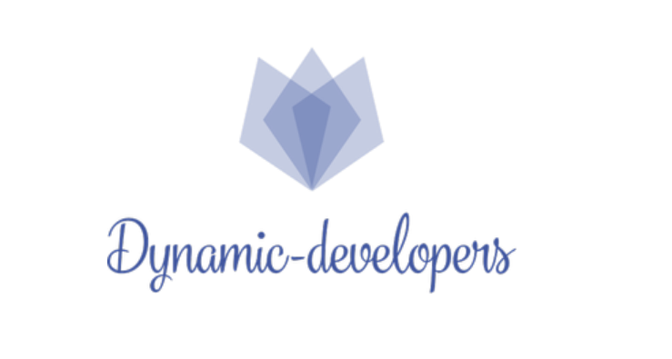

# ##
# Dynamic-developers

       

##  About us

- <b>[Раян Христов](https://github.com/RSHristov20) -> 9B -> Scrum Trainer </b>
- <b>[Стефан Чапкънов](https://github.com/SNChapkanov20) -> 9B -> Q&A</b>
- <b>[Йордан Жечев](https://github.com/YBZhechev20) -> 9B -> Backend Developer </b>
- <b>[Александър Фотев](https://github.com/ABFotev20) -> 9B -> Backend Developer </b>

##  Used 
-  [Github](https://kinsta.com/knowledgebase/what-is-github/)
-  [Discord](https://en.wikipedia.org/wiki/Discord_(software))
-   [C++](https://www.w3schools.com/cpp/cpp_intro.asp)
-  [Word](https://www.computerhope.com/jargon/m/microsoft-word.htm)
-  [PowerPoint](https://www.computerhope.com/jargon/p/powerpoi.htm)

##
